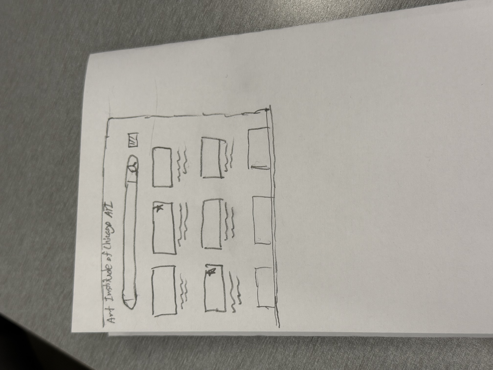
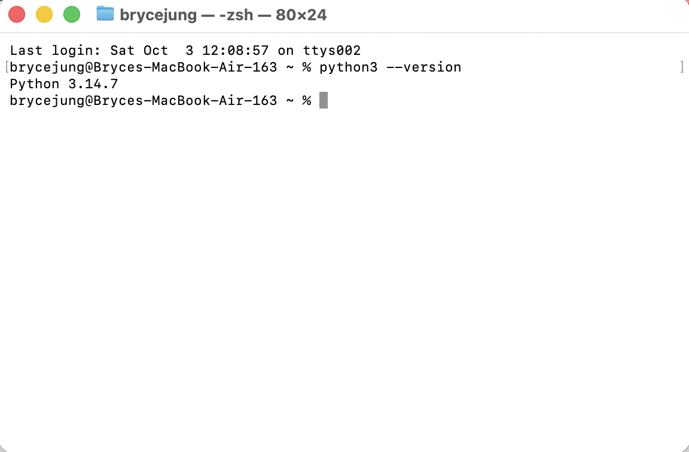

# Day 1 "before" snapshot

Write your own, even if you worked in a pair. Keep it: we come back to it at mid-quarter (Week 6) and at the end (Week 11). Your prompts go in `ai_log.md`, not here.

**Name: Bryce Jung** 
**Partner (if any): Julie**

## Before we prompted

### 1. Who is it for, and what do they want to do?

It's for people who want to look up groups of images based on a keyword.

**"The user can..." sentences:**
1. search for images in the search bar
2. favorite images to save for later

### 2. Our sketch

Put the photo in this `hw0` folder, then change the filename below to match:

### 3. Our prediction

We expected the app would... look pretty similar to the sketch in ways, but not get everything right. It might also add unexpected features.

## What we got

### 4. What the AI made

Put the screenshot in this `hw0` folder, then change the filename below to match:

### 5. Sketch vs. app

- **Matches our sketch:**
Search bar
Favorites
Boxes showing artwork, so like layout in general

- **Different from our sketch:**
Added sections like settings/dropdown
- **The AI decided** (something we never said):
Added public domain only
Added type (painting, watercolor, photo, etc.)

### 6. What did I keep, change, or reject, and why?
I changed the default starter search screen (nothing searched yet) because I wanted to add a little more personality to the app. I also changed it so when you cleared the search bar, it would take you back to this screen just so there would be a cleaner UI.

### 7. Explain back

Pick one part of the code. In your own words, what does it do?
The styles section has all the styling to make the web page look nice. For instance .bar makes the display flex, and centered. Page structure makes the webpage look like our sketch. For instance, the search bar is encased in a form so it can take input and then there are buttons to match what we put in our sketch.

## Looking ahead

### 8. What does it do? Does it work? What broke?

The app lets people search for images that are similar to the keyword that they put in like how I intended it to work. Nothing broke thankfully.

### 9. How much do I understand about how it works? (0–100%)

**My number:**
80%
**Why that number:**
I feel like I understand all of the code to a good degree. I know how HTML and CSS work, so I could understand that part. The only part I don't fully understand is how it's calling the API.

### 10. What would I need to know to tell whether it's *well designed or well built*?
I would need to know if it breaks or works in certain edgecases, how it performs under high traffic, and test it against a bunch of bugs.

### 11. What do I hope to be able to do by week 10?

I hope to be able to understand pretty much everything I'm outputting using AI and the foundation underneath it.
